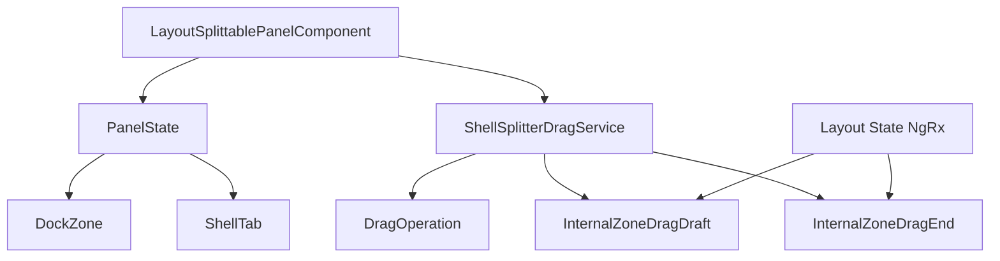

# Data Model: Internal Zone Resize via Flex Layout

## Entities

### Resizable Zone

**Description**: Represents a customizable area within a panel or workspace that can be resized by the user

**Fields**:
- `zone`: DockZone - Unique identifier for the zone
- `zoneType`: string - Type of zone (e.g., 'bottom-panel', 'primary-workspace', 'secondary-panel')
- `currentDimension`: number - Current dimension (width or height depending on direction) in pixels
- `minDimension`: number - Minimum dimension constraint (100px)
- `maxDimension`: number - Maximum dimension constraint (1000px)
- `direction`: 'horizontal' | 'vertical' - Direction of resize operation

**Validation Rules**:
- Dimension must be >= minDimension (100px)
- Dimension must be <= maxDimension (1000px)
- Zone must have a valid DockZone identifier
- Direction must be 'horizontal' or 'vertical'

**State Transitions**:
- Initial: Zone created with default dimensions
- Resizing: Zone dimension updated based on user interaction (draft state via DragOperation)
- Committed: Zone dimension finalized after drag ends
- Validation: Zone dimension checked against minimum/maximum constraints

---

### Splitter Handle

**Description**: The UI element that users interact with to resize adjacent zones

**Fields**:
- `zone`: DockZone - Zone identifier for the splitter handle
- `direction`: DragDirection - Direction of resize operation ('horizontal' or 'vertical')
- `initialDimension`: number - Initial dimension of the zone when drag starts

**Validation Rules**:
- Direction must be 'horizontal' or 'vertical'
- Zone must be a valid DockZone entity
- Initial dimension must be within min/max constraints

---

### Internal Zone Drag Draft

**Description**: Represents the draft dimension state of a zone during resize operations via DragOperation

**Fields**:
- `zone`: DockZone - Unique identifier for the zone being resized
- `direction`: DragDirection - Direction of resize ('horizontal' or 'vertical')
- `draftDimension`: number - Current dimension being drafted during drag

**State Transitions**:
- Initial: No draft state (null)
- Draft: Draft dimension is being updated during drag via DragOperation
- Committed: Draft dimension is finalized and emitted as InternalZoneDragEnd

---

### Internal Zone Drag End

**Description**: Represents the committed dimension state after drag ends

**Fields**:
- `zone`: DockZone - Unique identifier for the zone being resized
- `direction`: DragDirection - Direction of resize ('horizontal' or 'vertical')
- `committedDimension`: number - Final committed dimension after drag ends

**State Transitions**:
- Emitted when drag operation completes (pointer up event)
- Used to dispatch commit action to NgRx store

---

## Entity Relations

### Relation Descriptions

| Source Entity | Relation | Target Entity | Description |
|---------------|----------|---------------|-------------|
| LayoutSplittablePanelComponent | manages | PanelState | Component maintains array of panel states for each row/column |
| LayoutSplittablePanelComponent | uses | ShellSplitterDragService | Component uses drag service for internal zone pointer events |
| PanelState | references | DockZone | Each panel state references a dock zone |
| PanelState | references | ShellTab | Each panel state contains tabs for that zone |
| ShellSplitterDragService | uses | DragOperation | Service uses DragOperation class for drag state management |
| ShellSplitterDragService | emits | InternalZoneDragDraft | Service emits draft dimension updates during drag |
| ShellSplitterDragService | emits | InternalZoneDragEnd | Service emits committed dimension after drag ends |
| Layout State NgRx | receives | InternalZoneDragEnd | NgRx state receives commit action for dimension updates |

---

## State Transitions Overview

1. **Initial State**: Zones have default dimensions based on layout configuration
2. **Drag Start**: User clicks splitter handle, drag state is activated via `DragOperation.onPointerDown`
3. **Draft State**: As user drags, draft dimensions are emitted via `DragOperation.onPointerMove` as `InternalZoneDragDraft`
4. **Flex Layout Update**: Component binds draft dimensions to inline style properties on `splittable-panel-region` elements
5. **Drag End**: User releases splitter, committed dimension is emitted via `DragOperation.onPointerUp` as `InternalZoneDragEnd`
6. **Commit State**: NgRx store receives commit action, dimensions are finalized
7. **Validation**: Dimensions are validated against minimum/maximum constraints (100px minimum, 1000px maximum)
