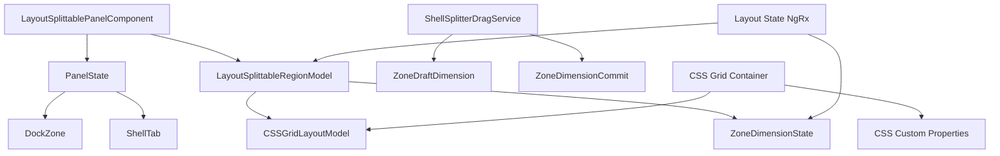

# Data Model: CSS Grid Dockzone Resize

## Entities

### Resizable Zone

**Description**: Represents a customizable area within a panel or workspace that can be resized by the user

**Fields**:
- `id`: string - Unique identifier for the zone (e.g., 'primary-top-left', 'bottom-center')
- `zoneType`: string - Type of zone (e.g., 'bottom-panel', 'primary-workspace', 'secondary-panel')
- `dimensions`: object - Current dimensions of the zone
  - `width`: number - Current width in pixels
  - `height`: number - Current height in pixels
- `minDimensions`: object - Minimum dimensions for the zone
  - `width`: number - Minimum width (100px)
  - `height`: number - Minimum height (100px)
- `maxDimensions`: object - Maximum dimensions for the zone (optional)
  - `width`: number - Maximum width (1000px)
  - `height`: number - Maximum height (1000px)
- `gridProperties`: object - CSS grid properties for the zone
  - `gridColumn`: string - CSS grid column property
  - `gridRow`: string - CSS grid row property

**Validation Rules**:
- Width and height must be >= 100px
- Zone must have a unique identifier
- Zone type must be a valid panel type

**State Transitions**:
- Initial: Zone created with default dimensions
- Resizing: Zone dimensions updated based on user interaction (draft state)
- Committed: Zone dimensions finalized after drag ends
- Validation: Zone dimensions checked against minimum/maximum constraints

---

### Splitter Handle

**Description**: The UI element that users interact with to resize adjacent zones

**Fields**:
- `id`: string - Unique identifier for the splitter handle
- `orientation`: string - Orientation of the splitter ('vertical' or 'horizontal')
- `zoneId1`: string - ID of the first zone adjacent to the splitter
- `zoneId2`: string - ID of the second zone adjacent to the splitter
- `direction`: 'horizontal' | 'vertical' - Direction of resize operation

**Validation Rules**:
- Orientation must be 'vertical' or 'horizontal'
- Both zoneId1 and zoneId2 must be valid zone identifiers

---

### Zone Dimension State

**Description**: Represents the current dimension state of a zone during resize operations

**Fields**:
- `zoneId`: string - Unique identifier for the zone
- `width`: number - Current width in pixels
- `height`: number - Current height in pixels
- `minWidth`: number - Minimum width constraint (100px)
- `minHeight`: number - Minimum height constraint (100px)
- `maxWidth`: number - Maximum width constraint (optional, 1000px)
- `maxHeight`: number - Maximum height constraint (optional, 1000px)

**State Transitions**:
- Initial: Zone has default dimensions
- Draft: Zone dimensions are being updated during drag
- Committed: Zone dimensions are finalized after drag ends

---

### Layout Splittable Region Model

**Description**: Represents the layout configuration for a splittable panel with CSS grid

**Fields**:
- `direction`: LayoutSplitDirection - Direction of split ('horizontal' or 'vertical')
- `zones`: Array<DockZone> - List of zones in the layout
- `sizes`: Array<string | number> - Size configuration for each zone (fr units or pixel values)
- `gridTemplateColumns`: string - CSS grid template columns property
- `gridTemplateRows`: string - CSS grid template rows property

**Validation Rules**:
- Direction must be 'horizontal' or 'vertical'
- Zones must be valid DockZone entities
- Sizes must match the number of zones

---

## Entity Relations

### Relation Descriptions

| Source Entity | Relation | Target Entity | Description |
|---------------|----------|---------------|-------------|
| LayoutSplittablePanelComponent | manages | PanelState | Component maintains array of panel states for each row/column |
| LayoutSplittablePanelComponent | uses | LayoutSplittableRegionModel | Component uses region model for layout configuration |
| PanelState | references | DockZone | Each panel state references a dock zone |
| PanelState | references | ShellTab | Each panel state contains tabs for that zone |
| LayoutSplittableRegionModel | uses | CSSGridLayoutModel | Region model uses CSS grid layout model for rendering |
| LayoutSplittableRegionModel | contains | ZoneDimensionState | Region model contains dimension state for each zone |
| ShellSplitterDragService | emits | ZoneDraftDimension | Service emits draft dimension updates during drag |
| ShellSplitterDragService | emits | ZoneDimensionCommit | Service emits committed dimension after drag ends |
| Layout State NgRx | contains | ZoneDimensionState | NgRx state contains dimension state for all zones |
| CSS Grid Container | uses | CSSGridLayoutModel | Container uses grid model for CSS grid properties |
| CSS Grid Container | uses | CSS Custom Properties | Container uses CSS vars for draft dimensions |

---

## CSS Grid Layout Model

### CSSGridLayoutModel

**Description**: Represents the CSS grid layout configuration for internal dockzones

**Fields**:
- `direction`: LayoutSplitDirection - Direction of split ('horizontal' or 'vertical')
- `gridTemplateColumns`: string - CSS grid template columns property (for horizontal direction)
- `gridTemplateRows`: string - CSS grid template rows property (for vertical direction)
- `zoneSizes`: Array<{zoneId: string, size: string | number}> - Size configuration for each zone

**Validation Rules**:
- Direction must be 'horizontal' or 'vertical'
- If direction is 'horizontal', `gridTemplateColumns` must be set
- If direction is 'vertical', `gridTemplateRows` must be set

---

## State Transitions Overview

1. **Initial State**: Zones have default dimensions based on layout configuration
2. **Drag Start**: User clicks splitter handle, drag state is activated
3. **Draft State**: As user drags, draft dimensions are emitted via `ShellSplitterDragService`
4. **CSS Grid Update**: Component binds draft dimensions to CSS custom properties
5. **Drag End**: User releases splitter, committed dimension is emitted
6. **Commit State**: NgRx store receives commit action, dimensions are finalized
7. **Validation**: Dimensions are validated against minimum/maximum constraints