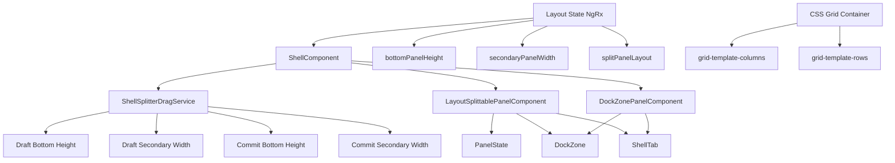

# Implementation Plan: CSS Grid Dockzone Resize

**Branch**: `014-css-grid-dockzone-resize` | **Date**: 2026-08-02 | **Spec**: [spec.md](../014-css-grid-dockzone-resize/spec.md)

## Summary

Enable users to resize internal dockzones within the bottom panel and primary workspaces by dragging vertical/horizontal splitters using CSS grid methods (`grid-template-columns`, `grid-template-rows`), similar to how it currently works for the secondary panel and bottom panel.

## Technical Context

**Language/Version**: TypeScript/Angular  
**Primary Dependencies**: Angular, NgRx  
**Storage**: N/A (in-memory state)  
**Testing**: Jest, Angular Testing Library  
**Target Platform**: Electron desktop application  
**Project Type**: Desktop application  
**Performance Goals**: Smooth resize operations without visual stuttering or performance issues (>30 FPS)  
**Constraints**: Must use CSS grid methods for resizing, maintain existing splitter functionality, respect minimum size constraints (100px width/height)  
**Scale/Scope**: Internal UI components for bottom panel and primary workspaces

## Constitution Check

*GATE: Must pass before Phase 0 research. Re-check after Phase 1 design.*

- ✅ **Official Stack and Layer Boundaries**: Using Angular for presentation layer, NgRx for state management
- ✅ **Shell-First UX Contract**: Resizing internal dockzones within bottom panel and primary workspaces
- ✅ **Single Reactive Paradigm (NgRx)**: Using NgRx for state changes and component communication
- ✅ **Security and Least Privilege**: No Electron/Node.js/OS API integration for this feature
- ✅ **Quality Gates and Traceability**: Spec has measurable acceptance criteria and planned execution paths

---

## Entity Relations Diagram



### Entity Definitions

| Entity | Description | Key Properties |
|--------|-------------|----------------|
| `ShellComponent` | Main shell component managing layout state | CSS vars: `--shell-sidebar-width`, `--shell-secondary-panel-width`, `--shell-bottom-panel-height` |
| `ShellSplitterDragService` | Handles pointer events for splitter dragging | `_draftBottomHeight$`, `_draftSecondaryWidth$`, commit events |
| `LayoutSplittablePanelComponent` | Manages splittable panel layout with CSS grid | `panelStates`, `zones`, `direction` |
| `DockZonePanelComponent` | Represents a dock zone with tabs | `zone`, `tabs`, `activeTabId`, `visible` |
| `PanelState` | State of a panel within a splittable layout | `visible`, `zone`, `row`, `column` |
| `LayoutSplittableRegionModel` | Model for split panel layout configuration | `direction`, `zones`, `sizes` |

---

## CSS Grid Implementation Approach

### Current Implementation (Secondary Panel & Bottom Panel)

The current implementation uses CSS custom properties (CSS vars) to control panel dimensions:

```css
/* shell.component.html bindings */
<div 
  #shellRoot
  class="shell-root"
  [style.--shell-secondary-panel-width]="shellSecondaryPanelWidthPx$ | async"
  [style.--shell-bottom-panel-height]="shellBottomPanelHeightPx$ | async"
>
```

```css
/* shell.component.css */
.shell-root {
  display: grid;
  grid-template-columns: var(--shell-sidebar-width) 1fr var(--shell-secondary-panel-width, 0px);
  grid-template-rows: 1fr var(--shell-bottom-panel-height, 0px);
}
```

### Internal Dockzone Resize Implementation

For internal dockzones within `LayoutSplittablePanelComponent`, we will use CSS grid methods dynamically:

```css
/* layout-splittable-panel.component.css - New Grid Layout */
.layout-splittable-grid-container {
    display: grid;
    gap: 0;
    width: 100%;
    height: 100%;
    overflow: hidden;
}

/* Horizontal direction (columns) */
.layout-splittable-grid-horizontal {
    grid-template-columns: repeat(auto-fit, minmax(100px, 1fr));
    grid-auto-columns: 1fr;
}

/* Vertical direction (rows) */
.layout-splittable-grid-vertical {
    grid-template-rows: repeat(auto-fit, minmax(100px, 1fr));
    grid-auto-rows: 1fr;
}

/* Active resize state */
.layout-splittable-grid-resizing {
    grid-template-columns: var(--zone-1-width, 1fr) var(--zone-2-width, 1fr);
    grid-template-rows: var(--zone-1-height, 1fr) var(--zone-2-height, 1fr);
}
```

---

## Implementation Strategy

### Phase 1: Foundation - State Management for Internal Zones

1. **Extend Layout State**: Add state for internal zone dimensions in `layout.reducer.ts`
2. **Create Zone Resize Actions**: Add actions for internal zone resize operations
3. **Update Layout Selectors**: Add selectors for internal zone dimensions

### Phase 2: Component Enhancement - LayoutSplittablePanelComponent

1. **Update Component State**: Add draft dimensions for internal zones
2. **Implement CSS Grid Binding**: Bind CSS grid properties to component state
3. **Add Splitter Handle Subscriptions**: Subscribe to splitter handle events for internal zones

### Phase 3: Drag Service Integration

1. **Extend ShellSplitterDragService**: Add methods for internal zone dragging
2. **Implement Debouncing/Throttling**: Add rAF throttle for resize events
3. **Apply Minimum Constraints**: Enforce 100px minimum size constraints

### Phase 4: Testing & Validation

1. **Unit Tests**: Test component state transitions and CSS grid bindings
2. **Integration Tests**: Test drag interactions and resize operations
3. **Performance Tests**: Verify >30 FPS during rapid drag operations

---

## Project Structure

### Documentation (this feature)

```text
specs/014-css-grid-dockzone-resize/
├── plan.md              # This file (/speckit.plan command output)
├── spec.md              # Feature specification
├── research.md          # Phase 0 research output
├── data-model.md        # Phase 1 data model output
├── quickstart.md        # Phase 1 quickstart guide
├── contracts/           # Phase 1 contracts
│   ├── zone-resize.contract.ts
│   └── css-grid-layout.contract.ts
├── architecture-decisions.md  # Architecture decision records
└── implementation-guide.md    # Step-by-step implementation guide
```

### Source Code (repository root)

```text
src/app/core/state/layout/
├── layout.actions.ts      # Add zone resize actions
├── layout.reducer.ts      # Add internal zone state
├── layout.selectors.ts    # Add zone dimension selectors

src/app/shell/services/
└── splitter-drag.service.ts  # Extend for internal zones

src/app/shell/components/
├── layout-splittable-panel/
│   ├── layout-splittable-panel.component.ts
│   ├── layout-splittable-panel.component.html
│   └── layout-splittable-panel.component.css  # CSS grid implementation
├── shell-splitter-handle/
│   └── shell-splitter-handle.component.ts       # Internal zone subscriptions
└── dock-zone-panel/
    └── dock-zone-panel.component.ts
```

---

## Complexity Tracking

> **Fill ONLY if Constitution Check has violations that must be justified**

| Violation | Why Needed | Simpler Alternative Rejected Because |
|-----------|------------|-------------------------------------|
| CSS Grid for internal zones | Provides 2D layout control, consistent with existing patterns | Flexbox lacks 2D control for complex dockzone layouts |
| Draft state during drag | Prevents excessive NgRx store updates during rapid drag | Committing to store on every mouse move causes performance issues |